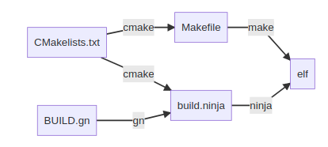

## FreeRTOS API

[FreeRTOS API](https://www.freertos.org/FreeRTOS-timers-xTimerCreate.html)

## ninga/GN

[ninja](https://ninja-build.org/)
对比make，除了快，没有其他毛病。
[gn](https://gn.googlesource.com/gn/)
用以大工程构建，优点就是快，缺点就是固定资源开销，小工程需要平衡。

## 编译链接

### 静态库与动态库

[C++静态库与动态库](https://www.runoob.com/w3cnote/cpp-static-library-and-dynamic-library.html)
[GCC 3.15 Options for Linking](https://gcc.gnu.org/onlinedocs/gcc/Link-Options.html#Link-Options)
[ld options 2.1 Command-line Options](https://sourceware.org/binutils/docs/ld/Options.html)
[static link:关于gcc连接静态库的几种方式](https://cloud.tencent.com/developer/article/1433457)
[[Linux]---浅谈静态库和动态库的打包与使用](https://blog.csdn.net/weixin_44747239/article/details/106384103)
[动态链接库与静态链接库相比，优势和劣势都在哪里？](https://www.zhihu.com/question/24306336)
[Linux下如何解决动态库的链接问题](https://blog.51cto.com/muhuizz/1927864)

### CFLAGS用法

CFLAGS 表示用于 C 编译器的选项，
CXXFLAGS 表示用于 C++ 编译器的选项。
这两个变量实际上涵盖了编译和汇编两个步骤。

CFLAGS： 指定头文件（.h文件）的路径，如：CFLAGS=-I/usr/include -I/path/include。同样地，安装一个包时会在安装路径下建立一个include目录，当安装过程中出现问题时，试着把以前安装的包的include目录加入到该变量中来。

LDFLAGS ：gcc 等编译器会用到的一些优化参数，也可以在里面指定库文件的位置。用法：LDFLAGS=-L/usr/lib -L/path/to/your/lib。每安装一个包都几乎一定的会在安装目录里建立一个lib目录。如果明明安装了某个包，而安装另一个包时，它愣是说找不到，可以抒那个包的lib路径加入的LDFALGS中试一下。
LIBS：告诉链接器要链接哪些库文件，如LIBS = -lpthread -liconv。

简单地说，LDFLAGS是告诉链接器从哪里寻找库文件，而LIBS是告诉链接器要链接哪些库文件。不过使用时链接阶段这两个参数都会加上，所以你即使将这两个的值互换，也没有问题。

有时候LDFLAGS指定-L虽然能让链接器找到库进行链接，但是运行时链接器却找不到这个库，如果要让软件运行时库文件的路径也得到扩展，那么我们需要增加这两个库给"-Wl,R"：
LDFLAGS = -L/var/xxx/lib -L/opt/mysql/lib -Wl,R/var/xxx/lib -Wl,R/opt/mysql/lib

如果在执行./configure以前设置环境变量export LDFLAGS="-L/var/xxx/lib -L/opt/mysql/lib -Wl,R/var/xxx/lib -Wl,R/opt/mysql/lib" ，注意设置环境变量等号两边不可以有空格，而且要加上引号（shell的用法）。那么执行configure以后，Makefile将会设置这个选项，链接时会有这个参数，编译出来的可执行程序的库文件搜索路径就得到扩展了。

-fPIC与-fpic都是在编译时加入的选项，用于生成位置无关的代码(Position-Independent-Code)。这两个选项都是可以使代码在加载到内存时使用相对地址，所有对固定地址的访问都通过全局偏移表(GOT)来实现。-fPIC和-fpic最大的区别在于是否对GOT的大小有限制。-fPIC对GOT表大小无限制，所以如果在不确定的情况下，使用-fPIC是更好的选择。
-fPIE与-fpie是等价的。这个选项与-fPIC/-fpic大致相同，不同点在于：-fPIC用于生成动态库，-fPIE用与生成可执行文件。再说得直白一点：-fPIE用来生成位置无关的可执行代码。

[CFLAGS用法](https://blog.csdn.net/qq_40309341/article/details/113541112)

## linux 内存模型

对各个内存分区的说明：

内存分区	说明
程序代码区(code)	存放函数体的二进制代码。一个C语言程序由多个函数构成，C语言程序的执行就是函数之间的相互调用。
常量区(constant)	存放一般的常量、字符串常量等。这块内存只有读取权限，没有写入权限，因此它们的值在程序运行期间不能改变。
全局数据区(global data)	存放全局变量、静态变量等。这块内存有读写权限，因此它们的值在程序运行期间可以任意改变。
堆区(heap)	一般由程序员分配和释放，若程序员不释放，程序运行结束时由操作系统回收。malloc()、calloc()、free() 等函数操作的就是这块内存，这也是本章要讲解的重点。注意：这里所说的堆区与数据结构中的堆不是一个概念，堆区的分配方式倒是类似于链表。
动态链接库	用于在程序运行期间加载和卸载动态链接库。
栈区(stack)	存放函数的参数值、局部变量的值等，其操作方式类似于数据结构中的栈。

[Linux下C语言程序的内存布局（内存模型）](https://www.cnblogs.com/zjuhaohaoxuexi/p/16210498.html)
[Linux内存模型——平坦、非连续与稀疏](https://cloud.tencent.com/developer/article/1518174)
[linux内存管理（详解）](https://zhuanlan.zhihu.com/p/149581303)
[深入理解Linux内存子系统](https://blog.csdn.net/lianhunqianr1/article/details/121299299)
[剖析程序的内存布局](https://zhuanlan.zhihu.com/p/98560503)

### 内存优化

Linux系统内存管理分为三层：应用层、内存分配器层、内核层。

应用层主要是APP管理本进程里堆栈内存的申请和使用，常见的问题有内存泄漏、内存越界等，出现问题的时候可以使用Asan和valgrind进行探测。内核层实现虚拟内存和物理内存的管理，一般不会有问题，考虑其实现的复杂性，即便是出了问题，也不是一般人可以解决的，哈哈。中间的内存分配器，就是连接应用层和内核层的纽带，类似于内存的批发、零售商，常见内存分配器是：ptmalloc（glibc标配）、tcmalloc（google公司开发）、jemalloc（FreeBSD标配，Facebook维护使用的较多)。

[记录一次linux应用内存调试过程（续）](https://blog.csdn.net/lhl_blog/article/details/129425054)
[2万字|30张图带你领略glibc内存管理精髓](https://mp.weixin.qq.com/s?__biz=Mzk0MzI4OTI1Ng==&mid=2247485953&idx=1&sn=f8cd484607ab07f15247ecde773d2e1c&chksm=c3376cc6f440e5d047f7e648c951fd583df82ab4e3dab5767baeddef9fe7c1270f05b039d8c4&cur_album_id=2070029091994386438&scene=189#wechat_redirect)
[Linux常用调试工具](https://blog.csdn.net/m0_68431045/article/details/128347009)
[Linux性能调优之 内存](https://lework.github.io/2019/10/22/mem/#top)
[mmap映射区和shm共享内存的区别总结](https://blog.csdn.net/hj605635529/article/details/73163513)
[mmap内存映射区和shm共享内存的区别](https://blog.csdn.net/woaiclh13/article/details/106409361)
[malloc和free的实现原理解析](https://jacktang816.github.io/post/mallocandfree/)

### 内存泄漏检测工具

- valgrind
- Asan
- strace
- gprof

[使用 Valgrind 检测 C++ 内存泄漏](http://senlinzhan.github.io/2017/12/31/valgrind/)

## linux ext4文件系统

## linux应用开发调试工具

- gdb/vscode debug
- ps
- top

## 网络协议

[Socket粘包问题的3种解决方案](https://developer.huawei.com/consumer/cn/forum/topic/0202454835022540808)
[TCP协议的粘包问题&解决方式](https://juejin.cn/post/7035811839959105549)

## Linux 进程间通信 IPC

[Linux进程间通信的实现原理？](https://zhuanlan.zhihu.com/p/69553562)
[Linux进程间通信——使用匿名管道](https://blog.csdn.net/ljianhui/article/details/10168031?spm=a2c6h.12873639.article-detail.4.5d01169emyuH1e)
[Linux进程间通信（四）：命名管道 mkfifo()、open()、read()、close() ](https://www.cnblogs.com/52php/p/5840229.html)
